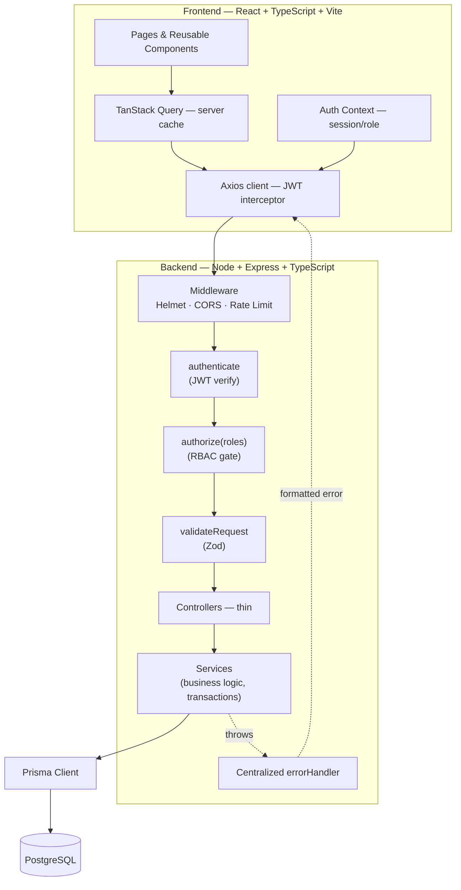
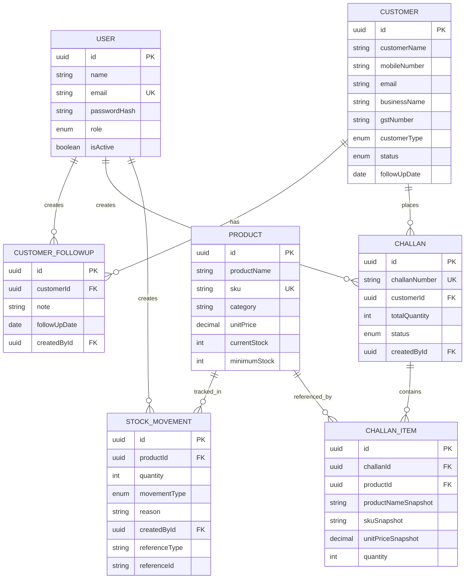
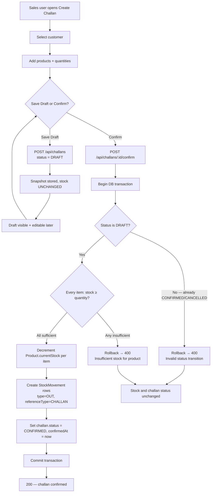

# Mini ERP + CRM Operations Portal — Architecture & Implementation Plan

This document is the single source of truth for the build. Every subsequent phase implements against this plan without re-litigating design decisions.

---

## 1. Final System Architecture

**Pattern:** Layered / clean architecture, monorepo with two independently deployable apps.

```
mini-erp-crm/
├── backend/     (Node + TypeScript + Express + Prisma + PostgreSQL)
├── frontend/    (React + TypeScript + Vite)
└── docs/        (README, ER diagrams, Postman collection)
```

**Request flow (backend):**

```
HTTP Request
  → Middleware (Helmet, CORS, express-rate-limit)
  → Route (maps URL → controller)
  → authenticate (verifies JWT, attaches req.user)
  → authorize(roles[]) (RBAC gate — checked server-side, never trusted from frontend)
  → validateRequest(zodSchema) (body/query/params validation)
  → Controller (thin — parses req, calls service, shapes response)
  → Service (all business logic — stock rules, challan transactions, snapshotting)
  → Prisma Client
  → PostgreSQL
  → centralized errorHandler (catches everything, returns consistent {success, message} shape)
```

Business logic never lives in routes, controllers, or React components — only in backend `services/`. This is the rule that keeps the challan/stock logic correct and testable.

**Frontend:** React Router for pages → TanStack Query for server state/caching → Axios client with interceptor for JWT attach + 401 handling → Context for auth session → feature folders per module → shared `components/ui` library.

**Auth model:** Stateless JWT (access token only, no refresh-token complexity — appropriate for MVP scope). Token stored client-side, sent as `Authorization: Bearer`. Backend is the sole enforcer of permissions; frontend hiding of buttons is UX only, never security.

---

## 2. Architecture Diagram



---

## 3. Complete Folder Structure

### Backend

```
backend/
├── prisma/
│   ├── schema.prisma
│   ├── seed.ts
│   └── migrations/
├── src/
│   ├── config/
│   │   ├── env.ts                  # validated env vars (zod)
│   │   └── prisma.ts               # singleton PrismaClient
│   ├── controllers/
│   │   ├── auth.controller.ts
│   │   ├── customer.controller.ts
│   │   ├── followup.controller.ts
│   │   ├── product.controller.ts
│   │   ├── inventory.controller.ts
│   │   ├── challan.controller.ts
│   │   ├── user.controller.ts
│   │   └── dashboard.controller.ts
│   ├── services/
│   │   ├── auth.service.ts
│   │   ├── customer.service.ts
│   │   ├── followup.service.ts
│   │   ├── product.service.ts
│   │   ├── inventory.service.ts
│   │   ├── challan.service.ts      # core transaction logic lives here
│   │   ├── challanNumber.service.ts
│   │   ├── user.service.ts
│   │   └── dashboard.service.ts
│   ├── routes/
│   │   ├── auth.routes.ts
│   │   ├── customer.routes.ts
│   │   ├── product.routes.ts
│   │   ├── inventory.routes.ts
│   │   ├── challan.routes.ts
│   │   ├── user.routes.ts
│   │   ├── dashboard.routes.ts
│   │   └── index.ts                # mounts all routers on /api
│   ├── middleware/
│   │   ├── authenticate.ts
│   │   ├── authorize.ts
│   │   ├── errorHandler.ts
│   │   ├── notFound.ts
│   │   ├── rateLimiter.ts
│   │   └── validateRequest.ts
│   ├── validators/
│   │   ├── auth.validator.ts
│   │   ├── customer.validator.ts
│   │   ├── followup.validator.ts
│   │   ├── product.validator.ts
│   │   ├── inventory.validator.ts
│   │   └── challan.validator.ts
│   ├── utils/
│   │   ├── ApiError.ts             # custom error class w/ statusCode
│   │   ├── ApiResponse.ts          # {success, data} / {success, message} shapers
│   │   ├── asyncHandler.ts         # wraps async controllers
│   │   ├── pagination.ts           # shared page/limit/skip helper
│   │   └── password.ts             # bcrypt hash/compare
│   ├── types/
│   │   ├── express.d.ts            # augments Request with req.user
│   │   └── index.ts
│   └── server.ts                   # app bootstrap, listens on PORT
├── tests/
│   ├── auth.test.ts
│   ├── customer.test.ts
│   ├── product.test.ts
│   └── challan.test.ts             # heaviest test file — transaction logic
├── .env.example
├── package.json
├── tsconfig.json
└── README.md
```

### Frontend

```
frontend/
└── src/
    ├── api/
    │   ├── axiosClient.ts          # base instance, JWT + 401 interceptor
    │   ├── auth.api.ts
    │   ├── customers.api.ts
    │   ├── products.api.ts
    │   ├── inventory.api.ts
    │   ├── challans.api.ts
    │   ├── users.api.ts
    │   └── dashboard.api.ts
    ├── components/
    │   ├── ui/
    │   │   ├── Button.tsx
    │   │   ├── Input.tsx
    │   │   ├── Select.tsx
    │   │   ├── Modal.tsx
    │   │   ├── DataTable.tsx
    │   │   ├── Badge.tsx
    │   │   ├── Card.tsx
    │   │   ├── Pagination.tsx
    │   │   ├── SearchBar.tsx
    │   │   ├── ConfirmDialog.tsx
    │   │   ├── LoadingState.tsx
    │   │   ├── EmptyState.tsx
    │   │   └── Toast.tsx
    │   └── layout/
    │       ├── Sidebar.tsx
    │       ├── Topbar.tsx
    │       └── AppLayout.tsx
    ├── layouts/
    │   └── ProtectedRoute.tsx      # route guard, role-aware
    ├── pages/
    │   ├── LoginPage.tsx
    │   ├── DashboardPage.tsx
    │   ├── customers/
    │   │   ├── CustomerListPage.tsx
    │   │   ├── CustomerDetailPage.tsx
    │   │   └── CustomerFormPage.tsx
    │   ├── products/
    │   │   ├── ProductListPage.tsx
    │   │   ├── ProductDetailPage.tsx
    │   │   └── ProductFormPage.tsx
    │   ├── inventory/
    │   │   └── InventoryPage.tsx
    │   ├── challans/
    │   │   ├── ChallanListPage.tsx
    │   │   ├── ChallanCreatePage.tsx
    │   │   └── ChallanDetailPage.tsx
    │   └── users/
    │       └── UserListPage.tsx
    ├── features/
    │   ├── customers/ (hooks, mutations tied to the module)
    │   ├── products/
    │   ├── inventory/
    │   └── challans/
    ├── hooks/
    │   ├── useAuth.ts
    │   ├── usePagination.ts
    │   └── useDebounce.ts
    ├── context/
    │   └── AuthContext.tsx
    ├── types/
    │   ├── customer.ts
    │   ├── product.ts
    │   ├── challan.ts
    │   └── user.ts
    ├── utils/
    │   ├── formatCurrency.ts
    │   └── formatDate.ts
    ├── routes/
    │   └── AppRouter.tsx
    ├── App.tsx
    └── main.tsx
```

---

## 4. Database ER Diagram



---

## 5. Complete Prisma Schema

```prisma
// prisma/schema.prisma

generator client {
  provider = "prisma-client-js"
}

datasource db {
  provider = "postgresql"
  url      = env("DATABASE_URL")
}

enum Role {
  ADMIN
  SALES
  WAREHOUSE
  ACCOUNTS
}

enum CustomerType {
  RETAIL
  WHOLESALE
  DISTRIBUTOR
}

enum CustomerStatus {
  LEAD
  ACTIVE
  INACTIVE
}

enum MovementType {
  IN
  OUT
}

enum ChallanStatus {
  DRAFT
  CONFIRMED
  CANCELLED
}

model User {
  id           String   @id @default(uuid())
  name         String
  email        String   @unique
  passwordHash String
  role         Role
  isActive     Boolean  @default(true)
  createdAt    DateTime @default(now())
  updatedAt    DateTime @updatedAt

  followUpsCreated CustomerFollowUp[] @relation("FollowUpCreatedBy")
  challansCreated  Challan[]          @relation("ChallanCreatedBy")
  stockMovements   StockMovement[]    @relation("StockMovementCreatedBy")

  @@map("users")
}

model Customer {
  id           String         @id @default(uuid())
  customerName String
  mobileNumber String
  email        String?
  businessName String?
  gstNumber    String?
  customerType CustomerType
  address      String?
  status       CustomerStatus @default(LEAD)
  followUpDate DateTime?
  notes        String?
  createdAt    DateTime       @default(now())
  updatedAt    DateTime       @updatedAt

  followUps CustomerFollowUp[]
  challans  Challan[]

  @@index([status])
  @@index([customerType])
  @@index([mobileNumber])
  @@map("customers")
}

model CustomerFollowUp {
  id           String    @id @default(uuid())
  customerId   String
  note         String
  followUpDate DateTime?
  createdById  String
  createdAt    DateTime  @default(now())

  customer  Customer @relation(fields: [customerId], references: [id], onDelete: Cascade)
  createdBy User     @relation("FollowUpCreatedBy", fields: [createdById], references: [id])

  @@index([customerId])
  @@map("customer_followups")
}

model Product {
  id                String   @id @default(uuid())
  productName       String
  sku               String   @unique
  category          String
  unitPrice         Decimal  @db.Decimal(12, 2)
  currentStock      Int      @default(0)
  minimumStock      Int      @default(0)
  warehouseLocation String?
  isActive          Boolean  @default(true)
  createdAt         DateTime @default(now())
  updatedAt         DateTime @updatedAt

  stockMovements StockMovement[]
  challanItems   ChallanItem[]

  @@index([category])
  @@map("products")
}

model StockMovement {
  id            String       @id @default(uuid())
  productId     String
  quantity      Int
  movementType  MovementType
  reason        String
  createdById   String
  referenceType String?      // e.g. "CHALLAN", "MANUAL"
  referenceId   String?      // e.g. challan id
  createdAt     DateTime     @default(now())

  product   Product @relation(fields: [productId], references: [id])
  createdBy User    @relation("StockMovementCreatedBy", fields: [createdById], references: [id])

  @@index([productId])
  @@index([movementType])
  @@index([referenceType, referenceId])
  @@map("stock_movements")
}

// Guarantees atomic, gap-free challan numbering per year (CH-2026-000001...)
model ChallanCounter {
  year  Int @id
  count Int @default(0)

  @@map("challan_counters")
}

model Challan {
  id            String        @id @default(uuid())
  challanNumber String        @unique
  customerId    String
  totalQuantity Int           @default(0)
  totalAmount   Decimal       @default(0) @db.Decimal(12, 2)
  status        ChallanStatus @default(DRAFT)
  createdById   String
  confirmedAt   DateTime?
  cancelledAt   DateTime?
  createdAt     DateTime      @default(now())
  updatedAt     DateTime      @updatedAt

  customer  Customer      @relation(fields: [customerId], references: [id])
  createdBy User          @relation("ChallanCreatedBy", fields: [createdById], references: [id])
  items     ChallanItem[]

  @@index([status])
  @@index([customerId])
  @@map("challans")
}

model ChallanItem {
  id                  String  @id @default(uuid())
  challanId           String
  productId           String
  productNameSnapshot String
  skuSnapshot         String
  unitPriceSnapshot   Decimal @db.Decimal(12, 2)
  quantity            Int

  challan Challan @relation(fields: [challanId], references: [id], onDelete: Cascade)
  product Product @relation(fields: [productId], references: [id])

  @@index([challanId])
  @@index([productId])
  @@map("challan_items")
}
```

**Design notes:**
- `ChallanCounter` (one row per year) is incremented inside the same DB transaction as challan creation, so numbers are unique and gap-free even under concurrent requests — solves requirement #9 correctly rather than via `COUNT(*)`.
- `ChallanItem` stores full snapshots (#8) — the relation to `Product` is kept only for reporting/stock linkage, never for display of historical challans.
- Soft-delete via `isActive` on `User`/`Product` instead of hard `DELETE`, since challan items and stock movements reference products by FK — hard deleting a product would break historical challans. Customer "Deactivate" maps to `status = INACTIVE`, not row deletion.

---

## 6. API Endpoint List

All responses use `{ success: boolean, data?: ..., message?: string }`. All non-auth routes require a valid JWT; role column shows who additionally passes the RBAC gate.

| Method | Endpoint | Roles | Notes |
|---|---|---|---|
| POST | `/api/auth/login` | Public | Rate-limited |
| GET | `/api/auth/me` | Any authenticated | Returns current user + role |
| POST | `/api/auth/logout` | Any authenticated | Clears client token (stateless) |
| GET | `/api/users` | ADMIN | Pagination |
| POST | `/api/users` | ADMIN | Create staff account |
| GET | `/api/users/:id` | ADMIN | |
| PUT | `/api/users/:id` | ADMIN | |
| PATCH | `/api/users/:id/deactivate` | ADMIN | |
| GET | `/api/customers?page&limit&search&status&type` | ADMIN, SALES, ACCOUNTS | |
| POST | `/api/customers` | ADMIN, SALES | |
| GET | `/api/customers/:id` | ADMIN, SALES, ACCOUNTS | Full detail view |
| PUT | `/api/customers/:id` | ADMIN, SALES | |
| DELETE | `/api/customers/:id` | ADMIN | Soft delete → INACTIVE |
| GET | `/api/customers/:id/followups` | ADMIN, SALES, ACCOUNTS | |
| POST | `/api/customers/:id/followups` | ADMIN, SALES | |
| GET | `/api/products?page&limit&search&category&lowStock` | All roles | Read access org-wide |
| POST | `/api/products` | ADMIN, WAREHOUSE | |
| GET | `/api/products/:id` | All roles | |
| PUT | `/api/products/:id` | ADMIN, WAREHOUSE | |
| DELETE | `/api/products/:id` | ADMIN | Soft delete → isActive=false |
| GET | `/api/inventory` | All roles | Stock summary, low-stock count |
| GET | `/api/inventory/movements?page&limit&productId&type` | All roles | |
| POST | `/api/inventory/movements` | ADMIN, WAREHOUSE | Manual IN/OUT adjustment |
| GET | `/api/challans?page&limit&search&status&customerId` | All roles | |
| POST | `/api/challans` | ADMIN, SALES | Creates as DRAFT |
| GET | `/api/challans/:id` | All roles | |
| PUT | `/api/challans/:id` | ADMIN, SALES | Only while status=DRAFT |
| POST | `/api/challans/:id/confirm` | ADMIN, SALES | Transactional stock deduction |
| POST | `/api/challans/:id/cancel` | ADMIN, SALES | Only while status=DRAFT |
| GET | `/api/dashboard/summary` | All roles | Aggregate counts |

---

## 7. Role-Permission Matrix

| Module | ADMIN | SALES | WAREHOUSE | ACCOUNTS |
|---|---|---|---|---|
| Dashboard | Full | Full | Full | Full (read-only) |
| Users | Full CRUD | — | — | — |
| Customers | Full CRUD | Full CRUD | — | Read-only |
| Customer Follow-ups | Full | Create + Read | — | Read-only |
| Products | Full CRUD | Read-only | Full CRUD | Read-only |
| Inventory / Stock Movements | Full (incl. manual adjustments) | Read-only | Full (incl. manual adjustments) | Read-only |
| Sales Challans | Full (incl. confirm/cancel) | Full (incl. confirm/cancel) | Read-only | Read-only |

Enforcement happens in the `authorize(...)` middleware on every route above — never inferred from the frontend. The frontend additionally hides inaccessible buttons/nav items for UX, but that is cosmetic only.

---

## 8. Frontend Page / Component Structure

**Pages (routed):**
- `/login` — LoginPage
- `/` — DashboardPage
- `/customers`, `/customers/new`, `/customers/:id`, `/customers/:id/edit`
- `/products`, `/products/new`, `/products/:id`, `/products/:id/edit`
- `/inventory` — stock overview + movement log + manual adjustment modal
- `/challans`, `/challans/new`, `/challans/:id`
- `/users` — ADMIN only

**Layout:** `AppLayout` = `Sidebar` (collapses to drawer on mobile, nav items filtered by role) + `Topbar` (page title, search slot, user menu with role badge) + content outlet. `ProtectedRoute` wraps every authenticated route and checks both "logged in" and "role allowed."

**Shared UI library (`components/ui`):** Button, Input, Select, Modal, DataTable (generic, columns-as-props, built-in pagination footer), Badge (status-colored), Card, Pagination, SearchBar (debounced), ConfirmDialog, LoadingState, EmptyState, Toast — every page composes from this set rather than writing bespoke markup, satisfying the "no duplicated UI code" requirement.

---

## 9. Challan Business-Flow Diagram



The `confirm` endpoint is the only place stock is ever reduced by a challan, it is wrapped in a single Prisma `$transaction`, and it re-checks `status === DRAFT` inside that transaction (not just before it) to close the race condition that would otherwise allow duplicate confirmation.

---

## 10. 48-Hour Implementation Plan

| Phase | Scope | Hours | Cumulative |
|---|---|---|---|
| 1 | Project setup, PostgreSQL, Prisma schema + migration | 3h | 0–3h |
| 2 | Auth, JWT, bcrypt, RBAC middleware | 4h | 3–7h |
| 3 | Customer CRM (backend + follow-ups) | 5h | 7–12h |
| 4 | Products + Inventory (backend) | 5h | 12–17h |
| 5 | Sales Challan + stock transaction logic | 6h | 17–23h |
| 6 | React UI — layout, component library, all pages (static) | 8h | 23–31h |
| 7 | Frontend ↔ backend integration | 6h | 31–37h |
| 8 | Testing, validation hardening, error handling pass | 5h | 37–42h |
| 9 | Deployment (frontend, backend, DB) | 3h | 42–45h |
| 10 | README, Postman collection, final cleanup | 3h | 45–48h |

Phase 5 and Phase 6 get the largest allocations deliberately: 5 is the highest-risk business logic, 6 is the largest surface area of UI work.

---

## 11. Phase-by-Phase Requirement Checklist

| Spec section | Requirement | Phase |
|---|---|---|
| 1 | Tech stack setup | 1 |
| 2 | Auth + roles | 2 |
| 3 | Customer CRM | 3 (backend), 6–7 (UI) |
| 4 | Products + Inventory module | 4 |
| 5 | Stock movement log | 4 |
| 6 | Sales challan workflow | 5 |
| 7 | Challan business logic (draft/confirm/reject/no-duplicate) | 5 |
| 8 | Product snapshot on challan items | 5 |
| 9 | Challan number generation | 5 |
| 10 | REST API conventions | 2–5 (built), 7 (consumed) |
| 11 | Database design (keys, indexes, timestamps) | 1 |
| 12 | Recommended schema | 1 |
| 13 | Backend clean architecture | 1 (scaffold), enforced 2–5 |
| 14 | Frontend architecture | 6 |
| 15 | Frontend UI/UX polish | 6 |
| 16 | Dashboard | 6 (layout), 7 (live data) |
| 17 | Customer page | 6–7 |
| 18 | Product page | 6–7 |
| 19 | Inventory page | 6–7 |
| 20 | Challan creation UI | 6–7 |
| 21 | Responsive UI | 6 |
| 22 | Validation (frontend + backend) | 2–5 (Zod backend), 6 (RHF+Zod frontend) |
| 23 | Centralized error handling | 2 (base handler), 8 (hardening pass) |
| 24 | Security (helmet, CORS, rate limit, env vars) | 2, 8 |
| 25 | Pagination + search | 3–5 |
| 26 | Seed data | 1 (script scaffold), finalized end of 5 |
| 27 | Testing (12 required cases) | 8 |
| 28 | Deployment | 9 |
| 29 | README | 10 |
| 30 | Postman collection | 10 |
| 31 | Meaningful commits | Every phase |
| 32 | Bonus features | After 10, only if time remains |
| 33 | Scope discipline (no extra modules) | Enforced every phase |
| 34 | Architecture quality | Verified in 8 |
| 35 | This planning document | Done (this file) |
| 36 | Final acceptance test flow | Verified in 8, re-verified in 9 |

---

## Assumptions Locked In (for the README's "Assumptions" section later)

- Single access JWT, no refresh-token rotation — acceptable for an assignment-scope MVP; noted as a "future improvement."
- Customer/Product "delete" = soft delete, to preserve referential integrity for historical challans.
- Challan `PUT` (edit) is only permitted while `status = DRAFT`; confirmed/cancelled challans are immutable except for the cancel transition.
- Manual stock adjustments (`POST /api/inventory/movements`) are separate from challan-driven movements — both write to the same `StockMovement` table, distinguished by `referenceType`.
- Dashboard figures are computed live (no caching/materialized views) — acceptable at this data scale.

---

**Next step:** reply `START PHASE 1` and I'll scaffold the backend project, PostgreSQL connection, and the full Prisma schema/migration exactly as defined above.
